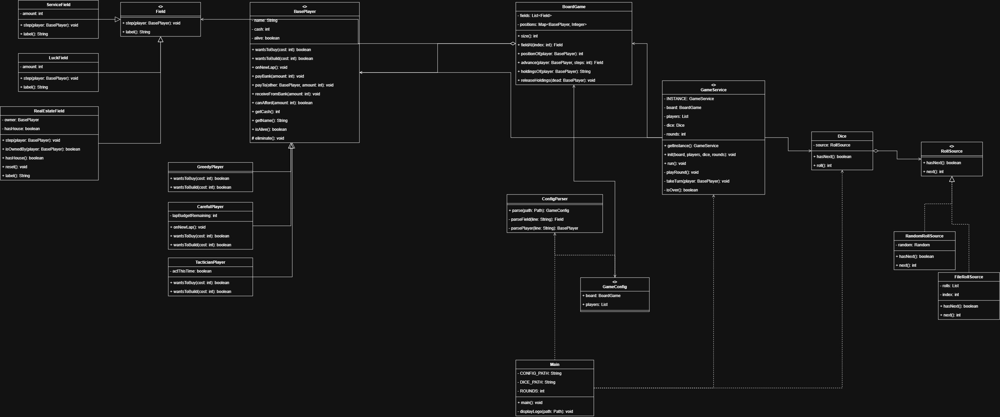

# Capitaly társasjáték-szimuláció

ELTE Programozási technológiák – 1. beadandó feladat.

## Tartalom

- [A feladat leírása](#a-feladat-leírása)
- [Fordítás és futtatás](#fordítás-és-futtatás)
- [Bemeneti fájlok formátuma](#bemeneti-fájlok-formátuma)
- [Osztálydiagram](#osztálydiagram)
- [Osztályok és metódusok rövid leírása](#osztályok-és-metódusok-rövid-leírása)
- [Alkalmazott tervezési minták](#alkalmazott-tervezési-minták)
- [A közös elvárások teljesítése](#a-közös-elvárások-teljesítése)
- [Tesztelés](#tesztelés)

## A feladat leírása

Egy egyszerűsített *Capitaly* társasjátékot szimulálunk. A játékosok egy
**körpályán** haladnak körbe-körbe: minden lépésben kockát dobnak, és annyit
lépnek előre, amennyit a kocka mutat. A pálya három típusú mezőből állhat:

- **Ingatlan (real estate):** gazdátlanul **1000 Peták**ért megvásárolható.
  A saját, még ház nélküli ingatlanra újra lépve **4000 Peták**ért ház
  építhető. Ha más játékos lép a mezőre, a tulajdonosnak fizet:
  **500 Peták**ot ha nincs ház, **2000 Peták**ot ha van.
- **Szolgáltatás (service):** a mezőre lépve a banknak kell befizetni a
  mező paraméterében megadott összeget.
- **Szerencse (luck):** a mezőre lépve a játékos a mezőben megadott összeget
  kapja a banktól.

Minden játékos **10 000 Peták** induló tőkével indul, és háromféle
**stratégia** szerint dönt a vásárlásról:

- **Mohó (greedy):** ha gazdátlan ingatlanon áll, vagy a saját, ház nélküli
  ingatlanján, és van rá elég pénze, akkor vásárol / épít.
- **Óvatos (careful):** egy **körben** (a pálya egy megkerülése) legfeljebb a
  tőkéje felét költi vásárlásra. A keret a kör elején a pillanatnyi tőke
  fele, és minden vásárlás csökkenti.
- **Taktikus (tactician):** minden második **valós** vásárlási lehetőséget
  kihagy. A számláló csak akkor billen át, ha a lehetőség valóban kihasználható
  (megvásárolható/építhető **és** van rá pénz). A kötelező fizetések (bérleti
  díj, szolgáltatás) nem befolyásolják.

Ha egy játékosnak fizetnie kell, de **nincs elég pénze, kiesik**: házai
elvesznek, ingatlanjai gazdátlanná (újra megvásárolhatóvá) válnak.

A program egy **előre megadott számú kör** lejátszása után kiírja, hogy a
versenyzők hogyan állnak: mennyi a tőkéjük, és milyen ingatlanokat
birtokolnak. A játék hamarabb is véget ér, ha legfeljebb egy játékos marad
életben, vagy ha (rögzített kockafájl esetén) elfogynak a dobások.

## Fordítás és futtatás

A program a projekt gyökeréből futtatandó, hogy az `assets/` és `resources/`
relatív útvonalak feloldhatók legyenek.

```bash
# Fordítás
javac -d out/production/capitaly $(find src -name '*.java')

# Futtatás
java -cp out/production/capitaly Main
```

A `Main` osztály néhány beállítása:

- `ROUNDS` – a lejátszandó körök száma (alapértelmezés: 10).
- `useFileRoll` – `true` esetén a kockadobások a `resources/dice.txt`-ből
  (rögzített, tesztelhető), `false` esetén véletlenszerűek.

## Bemeneti fájlok formátuma

### `resources/config.txt`

```
<mezők száma>
<mező-definíciók soronként>
<játékosok száma>
<játékos-definíciók soronként: Név stratégia>
```

A mező-definíciók:

- `PROPERTY` – ingatlan mező (nincs paraméter),
- `SERVICE <összeg>` – szolgáltatás mező a megadott pénzdíjjal,
- `LUCKY <összeg>` – szerencse mező a megadott jutalommal.

A stratégiák: `greedy`, `careful`, `tactician`. Példa:

```
8
LUCKY 2000
PROPERTY
SERVICE 800
LUCKY 1500
PROPERTY
SERVICE 8000
PROPERTY
SERVICE 500
3
Anna greedy
Bela careful
Cili tactician
```

### `resources/dice.txt`

Szóközzel elválasztott egész számok a kockadobások rögzített sorozataként:

```
1 2 5 6 6 4 2 1 4 3 3
```

## Osztálydiagram



## Osztályok és metódusok rövid leírása

### `capitaly.field`

**`Field`** – absztrakt ősosztály minden mezőhöz. A viselkedést polimorfizmus
adja, nincs típus szerinti elágazás a hívó oldalon.
- `step(BasePlayer)` – a mezőre lépő játékosra alkalmazza a mező hatását.
- `label()` – a mező típusának rövid, kiíráshoz használt neve.

**`RealEstateField`** – ingatlan mező. Nyilvántartja a tulajdonost és a
ház meglétét.
- `step(...)` – eldönti, hogy vásárlásról (`tryBuy`), építésről (`tryBuild`)
  vagy bérleti díjról (`payRent`) van-e szó, egymást kizáró ágakon.
- `isOwnedBy(player)` / `hasHouse()` – lekérdezők a kiíráshoz és a
  birtokállás felszabadításához.
- `reset()` – a mező gazdátlanná tétele (a tulajdonos kiesésekor).

**`ServiceField`** – szolgáltatás mező; `step` a banknak fizettet a megadott
összeggel. **`LuckField`** – szerencse mező; `step` a megadott összeget adja
a játékosnak.

### `capitaly.player`

**`BasePlayer`** – absztrakt játékos: név, tőke, életben van-e állapot és a
pénzmozgató primitívek.
- `wantsToBuy(int)` / `wantsToBuild(int)` – **absztrakt** döntési kampók,
  amelyeket a stratégia-alosztályok töltenek ki.
- `onNewLap()` – a tábla hívja, amikor a játékos egy kört teljesít
  (alapból üres).
- `payBank(int)` / `payTo(BasePlayer, int)` – fizetés a banknak, illetve egy
  másik játékosnak; ha nincs rá fedezet, a játékos kiesik (`eliminate`).
- `receiveFromBank(int)` – jóváírás (szerencse mező).
- `canAfford(int)`, `getCash()`, `getName()`, `isAlive()` – lekérdezők.

**`GreedyPlayer`** – mindig vásárol/épít, ha van rá pénze (állapotmentes).
**`CarefulPlayer`** – `lapBudgetRemaining` kerettel; `onNewLap()` a tőke
felére állítja, `wantsToBuy/Build` csak a kereten belül enged vásárolni, és
a döntéskor csökkenti azt. **`TacticianPlayer`** – `actThisTime` kapcsolóval
felváltva vásárol/kihagy, de csak valós (kihasználható) lehetőségeknél billen.

### `capitaly.gameboard`

**`BoardGame`** – a körpálya és a játékos-pozíciók egyedüli tárolója.
- `advance(player, steps)` – körkörösen lépteti a játékost (`% méret`),
  kör teljesítésekor meghívja `onNewLap()`-ot, és visszaadja a célmezőt.
- `holdingsOf(player)` – a játékos ingatlanjainak olvasható listája
  (házjelöléssel), pl. `#1 (house), #4`.
- `releaseHoldings(dead)` – a kiesett játékos minden ingatlanját
  felszabadítja (`reset`).
- `size()`, `fieldAt(int)`, `positionOf(player)` – lekérdezők.

### `capitaly.dice`

**`RollSource`** – kockaforrás-interfész (`hasNext`, `next`).
**`FileRollSource`** – fájlból beolvasott, véges, rögzített sorozat.
**`RandomRollSource`** – végtelen, 1–6 közötti véletlen dobások.
**`Dice`** – **homlokzat (facade)**: a játék csak ezen keresztül kér dobást
(`roll`), és nem tudja, hogy a forrás rögzített-e vagy véletlen.

### `capitaly.engine`

**`GameService`** – **singleton** játékvezérlő. Birtokolja a táblát, a
játékosokat és a kockát.
- `getInstance()` – az egyetlen példány.
- `init(board, players, dice, rounds)` – a játék felparaméterezése.
- `run()` – legfeljebb `rounds` kört játszik le (egy kör = minden életben
  lévő játékos egy-egy lépése), körönként naplóz, majd kiírja az állást.
- `playRound`, `takeTurn`, `isOver`, `aliveCount`, `announceStandings` –
  belső segédmetódusok a körök, a lépések és a kiírás vezérléséhez.

### `capitaly.config`

**`ConfigParser`** – a konfigurációs fájl beolvasása és objektumokká
alakítása (`parse`). A `parseField` / `parsePlayer` metódusok hibás adat
esetén `IllegalArgumentException`-t dobnak.
**`GameConfig`** – rekord, amely a kész táblát és a játékoslistát adja vissza.

### `Main`

A belépési pont: kiírja a logót, beolvassa a konfigurációt, összeállítja a
kocka-homlokzatot, felparaméterezi és elindítja a `GameService`-t, valamint
**lekezeli** a be­olvasási és a hibás-adat kivételeket.

## Alkalmazott tervezési minták

- **Polimorfizmus (template method jellegű):** a mező hatását a `Field`
  alosztályok `step()` metódusa adja; a vásárlási döntést a `BasePlayer`
  alosztályok `wantsToBuy/Build()` metódusa – típus szerinti `switch` nélkül.
- **Singleton:** `GameService` (egyetlen, globálisan elérhető játékvezérlő).
- **Facade:** `Dice` elrejti, hogy a dobás rögzített (`FileRollSource`) vagy
  véletlen (`RandomRollSource`) forrásból jön.

## A közös elvárások teljesítése

- **Közös ősosztályból származó objektumok gyűjteményben:** a mezők
  `List<Field>`-ben, a játékosok `List<BasePlayer>`-ben tárolódnak
  (`BoardGame`, `GameConfig`).
- **`foreach` a feldolgozásnál:** pl. `GameService.playRound` a játékosokon,
  `BoardGame.releaseHoldings` a mezőkön, `FileRollSource` a beolvasott
  sorokon, `Main.displayLogo` a logó során iterál `for (… : …)` szerkezettel.
- **Kivétel dobása és kezelése hibás adatra:** a `ConfigParser` ismeretlen
  mezőtípus/stratégia, hiányzó vagy nem szám értékű paraméter esetén
  `IllegalArgumentException`-t dob; ezt (az `IOException`-nal együtt) a
  `Main` elkapja és hibaüzenettel kezeli, a program nem omlik össze.

## Tesztelés

### Determinisztikus (rögzített kocka) teszt

`useFileRoll = true` mellett a `resources/dice.txt`
(`1 2 5 6 6 4 2 1 4 3 3`) és a fenti `config.txt` alapján a futás
reprodukálható. A 11 dobás a 4. körben elfogy, ezért a játék ott áll meg.
Várt végállás (az ellenőrzött lefutás szerint):

```
=== Standings after 4 round(s) ===
Bela       [alive] cash: 8700    properties: no properties
Anna       [alive] cash: 6500    properties: #1 (house), #4
Cili       [out]   cash: 1500    properties: no properties
```

Néhány ellenőrzött mozzanat ebben a lefutásban:

- **Bérleti díj a tulajdonosnak:** Cili az Anna gazdátlan→saját ingatlanára
  (1-es mező) lépve 500-at fizet Annának.
- **Ház növeli a bérleti díjat:** miután Anna házat épít az 1-es mezőre,
  Bela már 2000 bérleti díjat fizet 500 helyett.
- **Kiesés és felszabadítás:** Cili nem tudja kifizetni a 8000-es
  szolgáltatást, kiesik, ingatlanjai felszabadulnak.
- **Birtokállás kiírása:** Anna zárásnál `#1 (house), #4` ingatlanokat birtokol.

### Véletlen kocka teszt

`useFileRoll = false` mellett a `RandomRollSource` miatt a játék a megadott
`ROUNDS` körig tart (vagy addig, amíg egyetlen játékos marad). Ez igazolja,
hogy a két kockaforrás a `Dice` homlokzat mögött felcserélhető.

### Hibás bemenet teszt

Szándékosan elrontott `config.txt` esetén a program nem omlik össze, hanem
kezelt hibaüzenetet ír ki, például:

```
Hibás konfiguráció: Ismeretlen mezőtípus: WRONGTYPE
Hibás konfiguráció: For input string: "abc"
```
